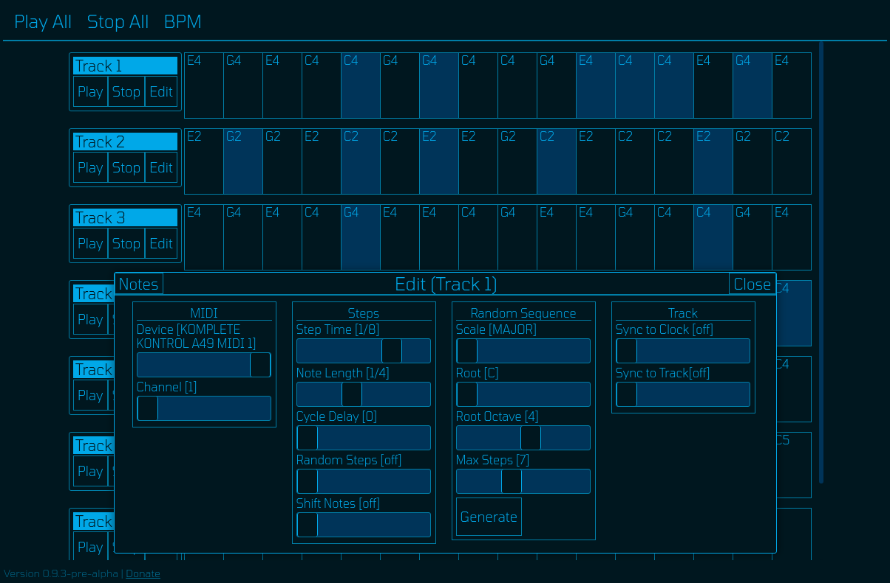

<h1 align="center">SEQU</h1>
<h4 align="center">Current Version: <a href="https://ryan-pickert.github.io/sequ/">[1.0.1-alpha]</a></h4>

Sequ is a multi-track step sequencer with randomization options.

Sequ uses <a href="https://tonejs.github.io/">Tone.js</a> as a clock source and <a href="https://github.com/djipco/webmidi">WebMidi.js</a> to send MIDI data.

**Features**
* Generate random sequences using a set scale
* Input notes via piano roll
* Activate/deactivate steps to your liking
* Up to eight tracks playing simultaneously
* Send tracks to different devices and MIDI channels

**Quick Start Guide**

>Connect your MIDI devices (if they aren't already) and restart the page.
>All availiable devices will be accessible under the 'MIDI' section in the edit menu. 

To create a sequence:
1. Choose the track you want to create the sequence on and click 'edit'.
2. To generate a random sequence, set the parameters to your liking and hit the 'generate' button.
3. You can enter notes manualy by clicking on 'notes' in the top left.
4. Choose the desired device and MIDI channel.
5. Hit the 'play' button under the track to start the sequence.
6. Hit 'play all' at the top to start all the tracks at once.

Notes:
- You can click on a step to activate/deactivate it.
- BPM must be changed before tracks are started.

This project is in very early development so there are some bugs and missing features!